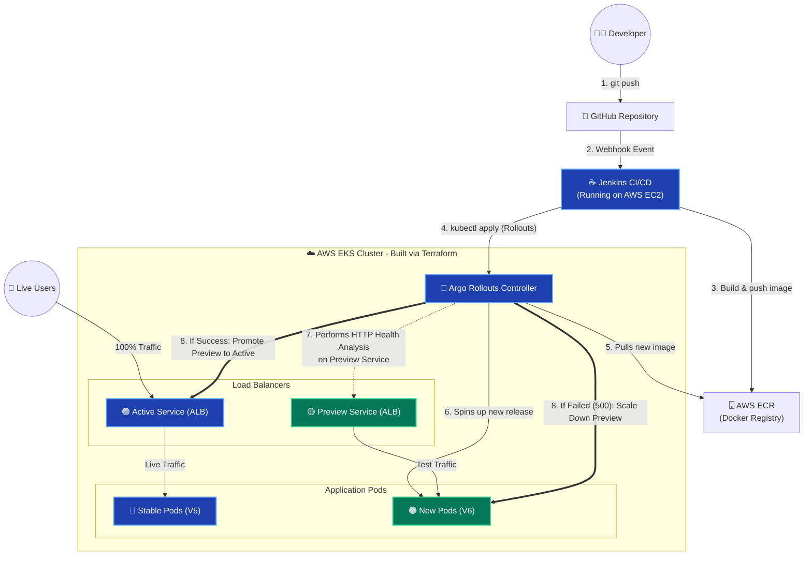

# Blue-Green Architecture with Jenkins (Updated)

Here is your finalized, end-to-end architecture diagram representing the complete cloud infrastructure after migrating to Jenkins. You can use this diagram to visually explain the flow of data and deployments during your Viva.

### 🧠 How to Explain This Diagram in Your Viva:

1. **The Automation Trigger (Steps 1 & 2):** Point out that the process is entirely hands-off. A `git push` fires a payload over the internet directly to the custom **AWS EC2 Jenkins Server**.
2. **The Build Engine (Steps 3 & 4):** Jenkins acts as the heart of the operation. It builds the Docker container, stores it cleanly in **AWS ECR**, and hands the declarative AWS architecture over to the Kubernetes cluster using `kubectl`.
3. **The Brain (Steps 5 & 6):** **Argo Rollouts** assumes control. It creates the green (preview) infrastructure *without* destroying the blue (stable) infrastructure. It isolates the new code behind the **Preview Load Balancer**.
4. **The Gatekeeper (Steps 7 & 8):** Explain how Argo mathematically verifies the health of the Preview Service via the `health.json` endpoint. If it returns `200`, Argo swaps the networking rules, immediately routing Live Users to the new version with zero downtime. If it returns `500`, Argo effortlessly kills the preview pods and the Live Users are never affected.
