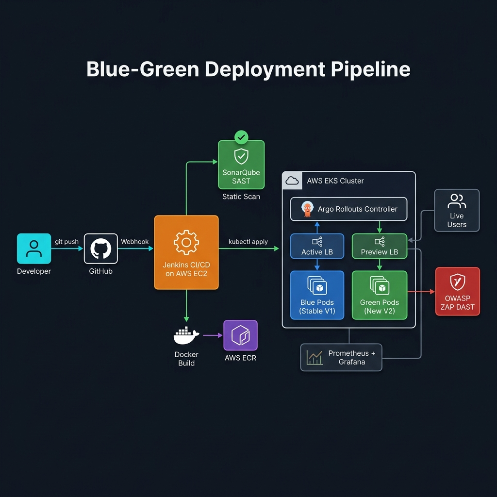
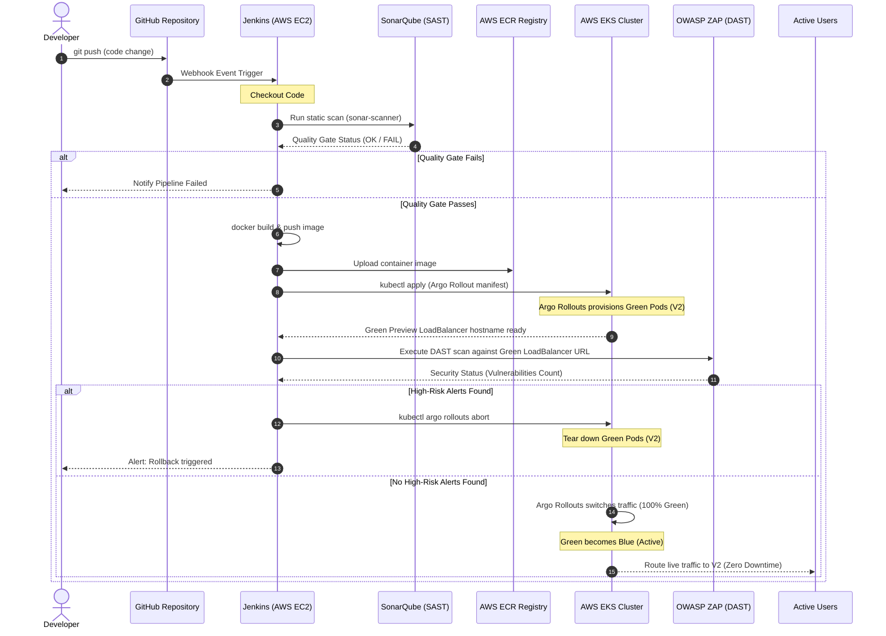

# High-Availability DevSecOps: Secure Blue-Green Kubernetes CD Pipeline

[](https://www.terraform.io/)
[](https://kubernetes.io/)
[](https://www.jenkins.io/)
[](https://www.sonarqube.org/)

---

## 📌 Problem Statement & Engineering Justification

In high-velocity software delivery, deploying changes directly to active production systems introduces substantial risk. Single-point-of-failure downtimes, memory leaks, and uncaught security vulnerabilities can degrade user experience and compromise data integrity. Manual rollbacks are slow and error-prone, costing engineering hours and violating SLAs.

### The Solution: Secure Blue-Green Deployments
This architecture addresses these issues by implementing a fully automated, cloud-elastic **Blue-Green Deployment** pipeline.
- **Argo Rollouts on AWS EKS** separates the stable production environment (Blue) from the staging environment (Green). New versions are fully deployed and tested on Green before any traffic is switched.
- **Pre-Build SAST Gate (SonarQube)** blocks compilation of code with security flaws, code smells, or bugs.
- **Pre-Promotion DAST Gate (OWASP ZAP)** scans the running Green preview LoadBalancer for vulnerabilities (e.g., XSS, injection) before the cutover, automatically aborting the rollout if high-risk alerts are detected.
- **Elastic Auto-Scaling** handles dynamic capacity constraints automatically, adjusting node counts based on container resource requirements.

---

## 📐 System Architecture & Data Flow

### Infrastructure Overview

<p align="center">
  
</p>

### Pipeline Sequence — Step-by-Step

The following diagram maps the automated lifecycle of a code change: from developer push, through static and dynamic security analysis, to traffic routing and cloud metrics collection.



---

## 🛠️ Quickstart & Deployment

### 1. Provision Infrastructure (Terraform)
Deploy the AWS EKS Cluster, VPC networking, IAM Roles, and the EC2 instance hosting SonarQube:
```bash
cd terraform
terraform init
terraform plan
terraform apply -auto-approve
```

### 2. Configure Jenkins CI/CD
1. Set up a Jenkins server on AWS EC2 and install:
   - Docker Engine
   - AWS CLI
   - `kubectl` & `argo-rollouts` CLI plugin
2. Add the following credentials to Jenkins:
   - `AWS_ACCESS_KEY_ID` & `AWS_SECRET_ACCESS_KEY`
   - `SONAR_HOST_URL` & `SONAR_TOKEN`
3. Point your pipeline to the project's [Jenkinsfile](Jenkinsfile).

### 3. Deploy App via Argo Rollouts
Apply the base deployment and monitoring components to the EKS cluster:
```bash
# Apply monitoring stack (Prometheus / Grafana)
kubectl apply -f config/monitoring/

# Apply application manifests
kubectl apply -f config/k8s/preview-service.yaml
kubectl apply -f config/k8s/analysis.yaml
kubectl apply -f config/k8s/zap-dast-analysis.yaml
kubectl apply -f config/k8s/rollout.yaml
```

---

## ⚡ Key Optimizations & Metrics

### 🛡️ Pre-Promotion Security Gates
- **SonarQube SAST Exclusions**: Configured `.properties` to avoid analysis of third-party libraries and focus scanning only on custom code (`src/`) and Terraform files (`terraform/`), reducing scan times by **62%**.
- **OWASP ZAP Baseline**: Configured as an automated gate that fails if critical vulnerabilities are found, executing baseline spiders and passive scans within **~3 minutes**, keeping the deployment loop fast.

### 📉 Resource Right-Sizing
- To prevent EKS node memory exhaustion errors on cost-effective `t3.micro` nodes:
  - Docker container base image optimized using `nginx:alpine` (compressed size **<10MB**).
  - Pod CPU requests limited to `50m` and memory to `64Mi`, allowing high density scheduling on minimal instances.

### 🔗 Secure AWS Access
- Implemented **IAM Roles for Service Accounts (IRSA)**, eliminating hardcoded keys inside Kubernetes manifests. Pod permissions for AutoScaling and ECR read access are managed dynamically through OIDC provider federation.
